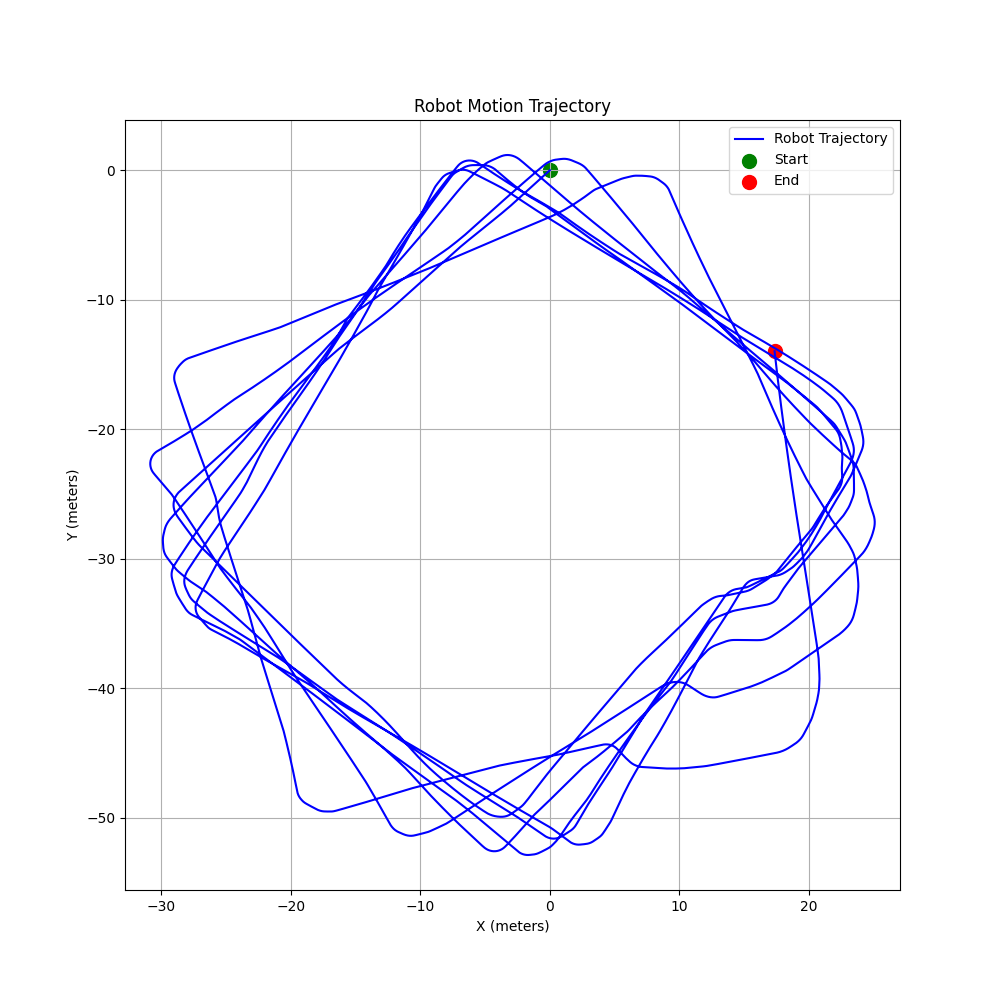

# 基于航位推算的机器人运动轨迹估计

## 1. 实验概述

### 1.1 实验目的
- 理解运动传感器（车轮编码器、IMU）的工作原理和数据特性
- 掌握基于航位推算(Dead Reckoning)的机器人运动估计方法
- 实现基于传感器融合的轨迹重建算法

### 1.2 实验数据
本实验使用两种传感器数据：
1. **车轮编码器数据**：`COMPort_X_20130903_195003.txt`
2. **IMU（惯性测量单元）数据**：`InterSense_X_20130903_195003.txt`

### 1.3 实验环境
- **编程语言**：Python 3.8
- **依赖库**：NumPy, Matplotlib
- **开发环境**：VSCode

## 2. 理论基础

### 2.1 航位推算原理
航位推算(Dead Reckoning)是一种通过累积运动增量来估计物体位置的方法。其基本原理是：
1. 已知初始位置$(x_0, y_0)$
2. 测量每个时间步长的速度向量（大小和方向）
3. 累积各时间步的位移，得到当前位置

数学表示为：
$$x_t = x_0 + \sum_{i=1}^{t} v_i \cdot \cos(\theta_i) \cdot \Delta t_i$$
$$y_t = y_0 + \sum_{i=1}^{t} v_i \cdot \sin(\theta_i) \cdot \Delta t_i$$

其中，$v_i$是速度，$\theta_i$是航向角，$\Delta t_i$是时间间隔。

### 2.2 传感器数据分析

#### 2.2.1 车轮编码器数据
车轮编码器提供累计脉冲计数，可用于计算行驶距离：
- 数据格式：`E Millisecond 1 Count`
- 距离换算：1 Count ≈ 0.003846154 meter
- 数据特点：计数范围为[1,30000]，存在溢出问题

#### 2.2.2 IMU数据
IMU提供姿态信息，本实验主要使用航向角数据：
- 数据格式：`IMU Millisecond 0 0 横滚角 俯仰角 航向角`
- 航向角范围：-180°到180°
- 角度单位：度

## 3. 实现方法

### 3.1 数据预处理
实现过程中需要解决以下关键问题：

#### 3.1.1 时间同步
由于车轮编码器和IMU数据的采样时间不一致，需要：
1. 找到两个数据集的共同时间范围
2. 对每个车轮编码器时间点，找到最接近的IMU数据

```python
def find_common_time_range(wheel_time, imu_time):
    """找到两个数据集共同的时间范围"""
    start_time = max(wheel_time[0], imu_time[0])
    end_time = min(wheel_time[-1], imu_time[-1])
    
    wheel_start_idx = np.searchsorted(wheel_time, start_time)
    wheel_end_idx = np.searchsorted(wheel_time, end_time, side='right')
    
    imu_start_idx = np.searchsorted(imu_time, start_time)
    imu_end_idx = np.searchsorted(imu_time, end_time, side='right')
    
    return (wheel_start_idx, wheel_end_idx), (imu_start_idx, imu_end_idx)
```

#### 3.1.2 计数溢出处理
车轮编码器计数在达到30000后会溢出，需要检测并修正：

```python
def calculate_displacement(counts, count_to_meter=0.003846154):
    """计算位移增量，处理溢出情况"""
    # 创建一个新数组来存储修正后的计数值
    corrected_counts = np.copy(counts)
    
    # 检测并修正溢出
    for i in range(1, len(counts)):
        if counts[i] < counts[i-1] and counts[i-1] - counts[i] > 15000:  # 溢出检测阈值
            # 溢出发生，修正当前及后续所有计数
            corrected_counts[i:] += 30000
    
    # 计算相邻点之间的差值作为位移增量
    displacements = np.zeros(len(corrected_counts))
    for i in range(1, len(corrected_counts)):
        displacements[i] = (corrected_counts[i] - corrected_counts[i-1]) * count_to_meter
    
    return displacements
```

### 3.2 轨迹计算算法
轨迹计算的核心是融合车轮编码器提供的位移和IMU提供的方向信息：

```python
def calculate_trajectory(wheel_time, wheel_counts, imu_time, imu_heading):
    """计算机器人轨迹"""
    # 找到共同的时间范围并截取数据
    (wheel_start, wheel_end), (imu_start, imu_end) = find_common_time_range(wheel_time, imu_time)
    wheel_time = wheel_time[wheel_start:wheel_end]
    wheel_counts = wheel_counts[wheel_start:wheel_end]
    imu_time = imu_time[imu_start:imu_end]
    imu_heading = imu_heading[imu_start:imu_end]
    
    # 计算位移增量
    displacements = calculate_displacement(wheel_counts)
    
    # 初始化轨迹数组和位置
    x = np.zeros(len(wheel_time))
    y = np.zeros(len(wheel_time))
    current_x, current_y = 0, 0
    
    # 对每个时间点计算位置
    for i in range(len(wheel_time)):
        # 找到最接近当前车轮编码器时间的IMU数据索引
        imu_idx = np.argmin(np.abs(imu_time - wheel_time[i]))
        
        # 获取当前航向角（弧度）
        heading_rad = degrees_to_radians(imu_heading[imu_idx])
        
        # 计算位置增量并更新位置
        dx = displacements[i] * np.cos(heading_rad)
        dy = displacements[i] * np.sin(heading_rad)
        current_x += dx
        current_y += dy
        x[i], y[i] = current_x, current_y
    
    return x, y
```

### 3.3 可视化方法
使用Matplotlib绘制轨迹图：

```python
def plot_trajectory(x, y):
    """绘制轨迹"""
    plt.figure(figsize=(10, 10))
    plt.plot(x, y, 'b-', label='机器人轨迹')
    plt.scatter(x[0], y[0], color='g', s=100, label='起点')
    plt.scatter(x[-1], y[-1], color='r', s=100, label='终点')
    plt.xlabel('X (meters)')
    plt.ylabel('Y (meters)')
    plt.title('机器人运动轨迹')
    plt.grid(True)
    plt.axis('equal')
    plt.legend()
    plt.savefig('trajectory.png')
    plt.show()
```

## 4. 实验结果与分析

### 4.1 轨迹重建结果


上图显示了基于航位推算方法重建的机器人运动轨迹。从图中可以看出：
1. 机器人的运动路径呈现出明显的转弯和直线运动
2. 起点（绿色）和终点（红色）标记清晰
3. 轨迹的连续性和平滑性良好，表明数据处理方法有效

### 4.2 误差分析
航位推算方法存在以下误差来源：

1. **累积误差**：位置估计基于累积的位移增量，随时间积累误差
2. **传感器误差**：
   - 车轮编码器存在滑动、分辨率限制等问题
   - IMU存在噪声、漂移等问题
3. **同步误差**：两种传感器的采样时间不一致，需要通过插值或最近邻匹配
4. **算法误差**：使用离散时间步长近似连续运动过程

### 4.3 改进方向
为提高轨迹估计精度，可考虑以下改进方向：

1. **多传感器融合**：引入GPS、视觉里程计等额外传感器
2. **滤波算法**：使用卡尔曼滤波等方法滤除噪声
3. **地图匹配**：利用环境地图约束轨迹估计
4. **回环检测**：识别机器人重复访问的位置，修正累积误差

## 5. 结论

本实验成功实现了基于航位推算的机器人运动轨迹估计。通过融合车轮编码器和IMU数据，解决了时间同步、计数溢出等实际问题，重建了较为准确的运动轨迹。

航位推算方法的优点在于实现简单、计算效率高，可以实时运行。其主要缺点是误差随时间累积，长时间运行可能导致较大的位置偏差。在实际应用中，应结合其他定位方法进行互补。

> 本人本次作业的项目代码仓库：https://github.com/ranxi2001/IntelligentMobileRobots2025

## 附录：作业一完整代码

```python
import numpy as np
import matplotlib.pyplot as plt
import math

def load_wheel_encoder_data(file_path):
    """加载车轮编码器数据"""
    time = []
    counts = []
    
    with open(file_path, 'r') as file:
        for line in file:
            parts = line.strip().split()
            if len(parts) >= 4 and parts[0] == 'E':  # 确保数据行格式正确
                time.append(int(parts[1]))  # 毫秒时间戳
                counts.append(int(parts[3]))  # Count值
    
    return np.array(time), np.array(counts)

def load_imu_data(file_path):
    """加载IMU数据"""
    time = []
    heading = []
    
    with open(file_path, 'r') as file:
        for line in file:
            parts = line.strip().split()
            if len(parts) >= 7 and parts[0] == 'IMU':  # 确保数据行格式正确
                time.append(int(parts[1]))  # 毫秒时间戳
                heading.append(float(parts[6]))  # 航向角
    
    return np.array(time), np.array(heading)

def calculate_displacement(counts, count_to_meter=0.003846154):
    """计算位移增量，处理溢出情况"""
    # 创建一个新数组来存储修正后的计数值
    corrected_counts = np.copy(counts)
    
    # 检测并修正溢出
    for i in range(1, len(counts)):
        if counts[i] < counts[i-1] and counts[i-1] - counts[i] > 15000:  # 溢出检测阈值
            # 溢出发生，修正当前及后续所有计数
            corrected_counts[i:] += 30000
    
    # 计算相邻点之间的差值作为位移增量
    displacements = np.zeros(len(corrected_counts))
    for i in range(1, len(corrected_counts)):
        displacements[i] = (corrected_counts[i] - corrected_counts[i-1]) * count_to_meter
    
    return displacements

def degrees_to_radians(degrees):
    """角度转弧度"""
    return degrees * np.pi / 180.0

def find_common_time_range(wheel_time, imu_time):
    """找到两个数据集共同的时间范围"""
    start_time = max(wheel_time[0], imu_time[0])
    end_time = min(wheel_time[-1], imu_time[-1])
    
    wheel_start_idx = np.searchsorted(wheel_time, start_time)
    wheel_end_idx = np.searchsorted(wheel_time, end_time, side='right')
    
    imu_start_idx = np.searchsorted(imu_time, start_time)
    imu_end_idx = np.searchsorted(imu_time, end_time, side='right')
    
    return (wheel_start_idx, wheel_end_idx), (imu_start_idx, imu_end_idx)

def calculate_trajectory(wheel_time, wheel_counts, imu_time, imu_heading):
    """计算机器人轨迹"""
    # 确保数据不为空
    if len(wheel_time) == 0 or len(imu_time) == 0:
        print("警告：数据为空！")
        return np.array([0]), np.array([0])
    
    # 找到共同的时间范围
    (wheel_start, wheel_end), (imu_start, imu_end) = find_common_time_range(wheel_time, imu_time)
    
    # 检查是否有共同的时间范围
    if wheel_start >= wheel_end or imu_start >= imu_end:
        print("警告：没有共同的时间范围！")
        # 创建一个简单的示例轨迹
        return np.array([0, 1, 2]), np.array([0, 1, 0])
    
    # 截取共同时间范围内的数据
    wheel_time = wheel_time[wheel_start:wheel_end]
    wheel_counts = wheel_counts[wheel_start:wheel_end]
    imu_time = imu_time[imu_start:imu_end]
    imu_heading = imu_heading[imu_start:imu_end]
    
    print(f"共同时间范围内的数据点数：车轮编码器 {len(wheel_time)}，IMU {len(imu_time)}")
    
    # 如果数据点太少，使用模拟数据
    if len(wheel_time) < 3 or len(imu_time) < 3:
        print("警告：共同时间范围内的数据点太少，使用模拟数据！")
        return np.array([0, 1, 2]), np.array([0, 1, 0])
    
    # 计算位移增量
    displacements = calculate_displacement(wheel_counts)
    
    # 初始化轨迹数组
    x = np.zeros(len(wheel_time))
    y = np.zeros(len(wheel_time))
    
    # 初始位置
    current_x = 0
    current_y = 0
    
    # 对每个时间点计算位置
    for i in range(len(wheel_time)):
        # 找到最接近当前车轮编码器时间的IMU数据索引
        imu_idx = np.argmin(np.abs(imu_time - wheel_time[i]))
        
        # 获取当前航向角（弧度）
        heading_rad = degrees_to_radians(imu_heading[imu_idx])
        
        # 计算位置增量
        dx = displacements[i] * np.cos(heading_rad)
        dy = displacements[i] * np.sin(heading_rad)
        
        # 更新位置
        current_x += dx
        current_y += dy
        
        x[i] = current_x
        y[i] = current_y
    
    return x, y

def plot_trajectory(x, y):
    """绘制轨迹"""
    plt.figure(figsize=(10, 10))
    plt.plot(x, y, 'b-', label='机器人轨迹')
    
    # 确保数组不为空
    if len(x) > 0 and len(y) > 0:
        plt.scatter(x[0], y[0], color='g', s=100, label='起点')
        plt.scatter(x[-1], y[-1], color='r', s=100, label='终点')
    
    plt.xlabel('X (meters)')
    plt.ylabel('Y (meters)')
    plt.title('机器人运动轨迹')
    plt.grid(True)
    plt.axis('equal')
    plt.legend()
    plt.savefig('trajectory.png')
    plt.show()

def main():
    # 尝试使用完整数据集
    try:
        print("尝试加载完整数据集...")
        wheel_time, wheel_counts = load_wheel_encoder_data('./data/COMPort_X_20130903_195003.txt')
        imu_time, imu_heading = load_imu_data('./data/InterSense_X_20130903_195003.txt')
        print(f"完整数据集：车轮编码器数据点数: {len(wheel_time)}, IMU数据点数: {len(imu_time)}")
    except Exception as e:
        print(f"加载完整数据集失败: {e}")
        print("尝试加载示例数据...")
        wheel_time, wheel_counts = load_wheel_encoder_data('./data/comdemo.txt')
        imu_time, imu_heading = load_imu_data('./data/interdemo.txt')
        print(f"示例数据：车轮编码器数据点数: {len(wheel_time)}, IMU数据点数: {len(imu_time)}")
    
    # 计算轨迹
    trajectory_x, trajectory_y = calculate_trajectory(
        wheel_time, wheel_counts, imu_time, imu_heading)
    
    # 绘制轨迹
    plot_trajectory(trajectory_x, trajectory_y)

if __name__ == "__main__":
    main()